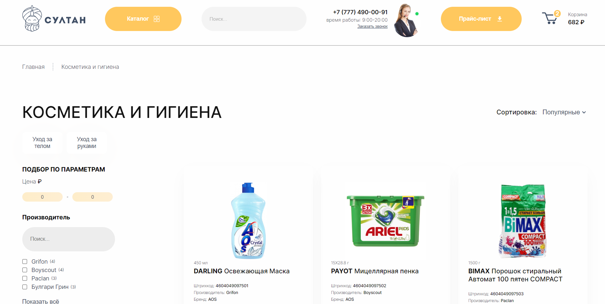
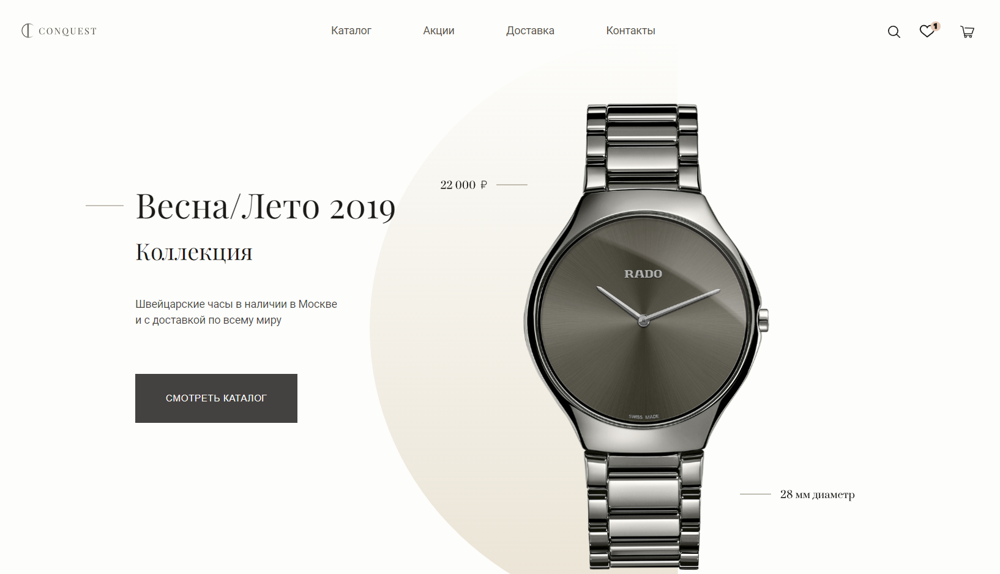
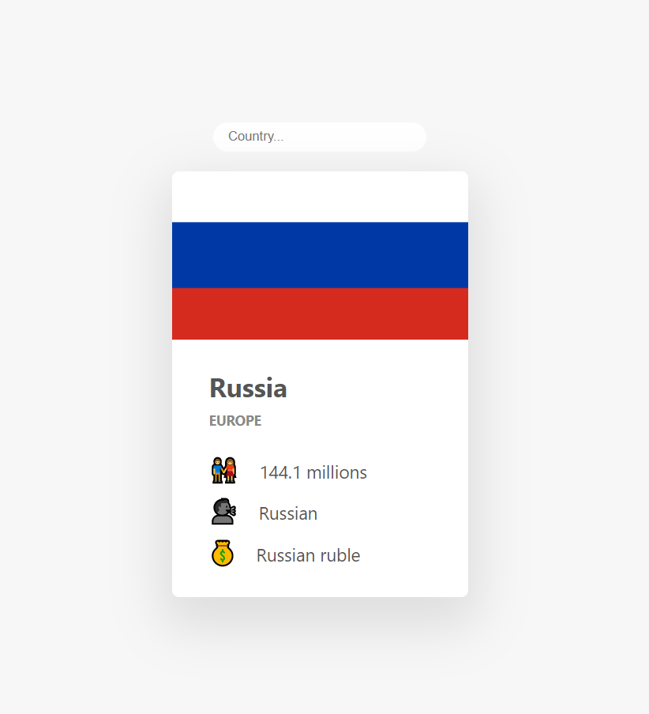

<h1 align="center">Матвей, Frontend разработчик / Matthew, Frontend Developer</h1>

<h2 align="center">Технологии / Technologies</h2>
    <h3 align="center">Основные / Primary</h3>
    

    
    
    

    <h3 align="center">Второстепенные / Secondary</h3>
    

    
    
    

 

<!-- ---

<h1 align="center">Мои проекты</h1>

<h3 align="center">Web applications</h3>
<table width="100%" >
 <tr>
  <td width="33%" valign="top" align="center">
    <a href="https://github.com/MoneyTreesIsThePerfectPlaceForShade/hotels-sultan-store">
      
Онлайн магазин

      
    </a>
  </td>
  <td width="33%" valign="top" align="center">
    <a href="https://github.com/MoneyTreesIsThePerfectPlaceForShade/hotels-watch-layout">
      
Лэндинг бренда

      
    </a>
  </td>
  <td width="33%" valign="top" align="center">
    <a href="https://github.com/MoneyTreesIsThePerfectPlaceForShade/countries-info">
      
Информация о стране

      
    </a>
  </td>
 </tr>
</table> -->
